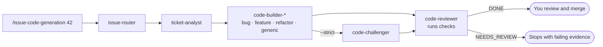

[](https://github.com/koydas/ai-dev-tools/actions/workflows/ci.yml)

# ai-dev-tools

**Claude Code agents that run your tests before they call a patch done.**

An interactive issue-to-patch pipeline for Claude Code: you type one command, a chain of specialized agents analyzes the issue, writes the patch, attacks it, and reviews it against **executed** checks — then stops at you. Nothing is committed, pushed or merged without a human. For the headless GitHub Actions counterpart, see [`autonomous-dev-loop`](https://github.com/koydas/autonomous-dev-loop).

| | |
|---|---|
| **Evidence, not opinion** | The reviewer runs the repo's own tests, lint and type-check (discovered from `CLAUDE.md`, CI workflows and manifests — never invented) and re-executes the builder's evidence. `DONE` requires every row of its Evidence table to be `PASS`, `N/A` or `PRE_EXISTING`. [ADR-009](docs/adr/ADR-009-tool-grounded-review.md) |
| **A red main doesn't block your PR — or hide** | A failure is `PRE_EXISTING` only if the merge-base's CI failed the same check, with the run URL cited. The base CI results are fetched by a script (`gh-get-check-runs.mjs`), not recalled by the model; the agent matches them and, in doubt, it's `FAIL`. |
| **Bug fixes must prove the bug** | Issues are routed to a bug, feature or refactor builder. The bug builder must ship a reproduction test that fails before the fix; the refactor builder must show non-regression. |
| **Adversarial pass on demand** | `--strict` adds a `code-challenger` agent whose only job is to break the patch before review. |
| **Never touches your tree behind your back** | Patches land uncommitted; agents never checkout, stash, reset or clean. Fork PRs execute nothing without your explicit approval. |
| **Resumable** | Up to five checkpoints per run (four without `--strict`); `/resume` restarts from the first missing step after a rate limit or crash. |

Each of these is a named pattern documented in [`agent-patterns`](https://github.com/koydas/agent-patterns): `router`, `sequential-pipeline`, `typed-evidence-chain`, `critic-pair`, `tool-grounded-review`, `checkpoint-resume`, `human-gate`.

**Try it** (Node ≥ 20, Claude Code, authenticated `gh`):

```bash
git clone https://github.com/koydas/ai-dev-tools ~/dev/ai-dev-tools
node ~/dev/ai-dev-tools/scripts/onboarding.mjs
# then, in Claude Code inside any repo:  /issue-code-generation <issue-number>
```

Full setup: [Setup](#setup).

---

## How it works

The human is a **gate**, not a relay. Commands orchestrate agents; agents do one thing well; skills shape how they reason.



**Example run** (illustrative, not a recorded run):

```bash
# In your terminal
$ gh issue view 42
title:  Add rate limiting to API gateway
body:   As a DevOps engineer, I want requests capped per client key...

# In Claude Code
> /issue-code-generation 42

[issue-router]    Classifying issue #42...
  → feature

[ticket-analyst]  Parsing issue #42...
  → DONE — brief: rate-limiting middleware, scope: api-gateway/middleware/

[code-builder-feature]  Generating patch...
  → DONE — 3 files changed, tests included

[code-reviewer]   Validating against acceptance criteria, running checks...
  → Evidence: Tests PASS 42/42 · Lint PASS · Type-check N/A
  → NEEDS_REVIEW — missing error code on quota exceeded

Review report → ~/dev/pr-reviews/42-rate-limiting.md
```

### Skills / Agents / Commands

| Primitive | Role | How it works |
|---|---|---|
| **Skills** | Passive context | Conventions, patterns, rules loaded automatically via `CLAUDE.md`. Shape *how* the agent reasons without being called explicitly. |
| **Agents** | Execution units | Discrete, specialized, explicit I/O contracts. Do one thing well. Chainable via structured `### Status / ### Handoff` blocks. |
| **Commands** | Orchestrators | Chain agents, invoke scripts, manage workflow state. Type `/name` in Claude Code to trigger a full pipeline. |

### Output contract (all agents)

Every agent produces a structured output block — this makes them chainable without human interpretation between steps:

```markdown
### Status
[DONE | BLOCKED | NEEDS_REVIEW] — one-line summary

### <Agent-specific section>
...findings, code, analysis...

### Handoff
Next step and what to pass forward
```

---

## Reference

### Commands

| Invoke | Agents used | What it does |
|---|---|---|
| `/issue-code-generation [id] [--strict]` | `issue-router` → `ticket-analyst` → `code-builder-*` → (`code-challenger`) → `code-reviewer` | Full issue → code → AC validation pipeline. `--strict` activates critic-pair (code-challenger) before review |
| `/resume [id] --repo <owner/repo> [--strict]` | — | Resume an interrupted `/issue-code-generation` run from its first missing checkpoint |
| `/pr-review` | `pr-analyst` | Review PR, write structured report to `~/dev/pr-reviews/` |
| `/pr-fixer` | `code-builder` | Apply blocking fixes from an existing review file |
| `/ac-check [id]` | `code-reviewer` | Validate code coverage against issue acceptance criteria |
| `/bug-seeker [id]` | — | Interactive investigation — issue, logs, code → diagnostic report |
| `/issue-notes [id]` | — | Generate technical overview, post as GitHub issue comment |
| `/demo-prep` | — | Feature description → slide-ready sprint demo content |
| `/token-audit [days]` | — | Audit Claude Code token usage — trends, model breakdown, command adoption |
| `/check-releases` | — | List repos with main changes not yet in a release |
| `/sync-ai-dev-tools` | — | Sync commands, agents, and prompts from this repo to `~/.claude` |

### Agents

| Agent | Input | Output |
|---|---|---|
| `issue-router` | Raw GitHub issue | Type (`bug` / `feature` / `refactor` / `security`) → selects the builder variant |
| `ticket-analyst` | Raw GitHub issue | Concise implementation brief with acceptance criteria |
| `code-builder-bug` | Brief | Reproduction (test failing before the fix) + smallest correct patch |
| `code-builder-feature` | Brief | Patch + AC coverage checklist |
| `code-builder-refactor` | Brief | Patch + non-regression evidence |
| `code-builder` | Implementation brief | Smallest correct patch — generic fallback for `security` / unclassified issues, and `/pr-fixer` |
| `code-challenger` | Patch + AC + issue type | Failure modes the builder missed (`--strict` only) |
| `code-reviewer` | Diff + context | Bugs, regressions, risks, missing tests — grounded in executed checks |
| `pr-analyst` | PR diff | Structured review summary with an Evidence table of executed checks |
| `doc-builder` | Repo/branch context | Documentation |
| `impact-analyst` | Proposed change | Cross-repo blast radius analysis |

### Skills

| Skill | Loaded when | What it enforces |
|---|---|---|
| `scope-guard.md` | Always | Changes stay inside the authorized file perimeter |
| `wiki-first.md` | Always | Wiki/docs lookup before any business logic implementation |
| `git-conventions.md` | Any git op | Commit format, branching strategy, merge rules |
| `branch-pr.md` | Any git op | Branch, commit, and PR naming conventions |
| `dotnet-repository.md` | C# work | Repository/Handler/Controller patterns (Dapper) |
| `vue-ui.md` | Vue work | Component structure, store, i18n |
| `vue-service.md` | Vue work | Vuex service and store conventions |

> Skills are loaded by the global `CLAUDE.md` at workspace root, which acts as a navigation orchestrator — it routes to per-repo `CLAUDE.md` files and injects the relevant skills based on file paths being touched.

### Scripts

| Script | What it does | Usage |
|---|---|---|
| `onboarding.mjs` | Full setup — copy workspace config, create skills junction, deploy commands and agents | CLI |
| `sync-claude.mjs` | Incremental sync from `ai-dev-tools` → `~/.claude` (reports new/updated/extra) | CLI / via `/sync-ai-dev-tools` |
| `gh-get-issue.mjs` | Fetch GitHub issue by number → JSON | CLI / via commands |
| `gh-get-pr.mjs` | Fetch PR by number, `owner/repo#n`, URL or source branch | CLI / via commands |
| `normalize-pr.mjs` | Map a PR fetched through GitHub MCP / REST to the `gh-get-pr.mjs` fields (ADR-010) | CLI / via commands |
| `gh-get-pr-threads.mjs` | Fetch reviewer comment threads for a PR | CLI / via commands |
| `gh-get-check-runs.mjs` | Fetch the CI check runs of a commit (or of the merge-base with a branch) → JSON, for `PRE_EXISTING` evidence | via `/pr-review`, `/ac-check`, `/issue-code-generation`, `/pr-fixer` |
| `gh-post-comment.mjs` | Post a comment to a GitHub issue | CLI / via commands |
| `gh-my-issues.mjs` | List issues assigned to current user | CLI |
| `token-audit.mjs` | Aggregate token usage from Claude Code JSONL session files | via `/token-audit` |
| `update-repos.mjs` | Pull latest on all configured repos | CLI |
| `list-files.mjs` | Recursive numbered file listing | CLI |
| `checkpoint.mjs` | Write / read / list pipeline checkpoints, namespaced by repo and issue | via `/issue-code-generation`, `/resume` |
| `check-releases.mjs` | List repos with changes on main not yet in a release | via `/check-releases` |
| `config.mjs` | `loadGitConfig()` — reads `configs/git.yaml` | library |

---

## Structure

```
ai-dev-tools/
├── agents/       Specialized subagents — explicit I/O contracts, chainable
├── commands/     Slash commands — type /name in Claude Code to invoke a pipeline
├── skills/       Stack conventions — loaded automatically via CLAUDE.md
├── scripts/      GitHub CLI, token auditing, sync utilities
├── prompts/      Standalone prompt templates for manual use
├── docs/
│   ├── adr/          Architecture Decision Records
│   └── commands/     Reference docs for each slash command
└── workspace/    Config files deployed to your dev root on setup
    ├── CLAUDE.md            Workspace orchestrator
    └── .claude/CLAUDE.md    Execution rules
```

---

## Setup

### Prerequisites

- Node ≥ 20
- [Claude Code CLI](https://docs.anthropic.com/en/docs/claude-code) — requires an Anthropic account with Claude Code access (paid plan or active quota)
- [GitHub CLI](https://cli.github.com/) authenticated
- Git

### Install

```bash
git clone https://github.com/koydas/ai-dev-tools ~/dev/ai-dev-tools
node ~/dev/ai-dev-tools/scripts/onboarding.mjs
```

Then open `.env` and set `gh_token` (scope: `repo, read:org`). The file is git-ignored.

### Sync after updates

```bash
node ~/dev/ai-dev-tools/scripts/sync-claude.mjs
```

> **Windows?** All scripts target PowerShell-compatible paths. The onboarding script creates a junction for `skills/` rather than a symlink.

---

## Extending

See [CONTRIBUTING.md](CONTRIBUTING.md) for how to add agents and commands.

---

## Related

| Repo | What it demonstrates |
|---|---|
| [`autonomous-dev-loop`](https://github.com/koydas/autonomous-dev-loop) | Bounded-autonomy GitHub-native SDLC — Issue → AI coder → PR → AI reviewer → iterative loop → human merge gate. Groq-backed, GitHub Actions orchestration, prompt files loaded at runtime. |
| [`agent-patterns`](https://github.com/koydas/agent-patterns) | The multi-agent patterns this toolbox implements — diagrams, trade-offs, failure modes, runnable code. |
| [`fullstack-pilot`](https://github.com/koydas/fullstack-pilot) | Polyglot multi-service stack: React/Vite, Node/Express, Flask, .NET — across MongoDB, PostgreSQL, and SQL Server. Includes CI/CD workflows, ADRs, and a Mermaid architecture diagram. |
